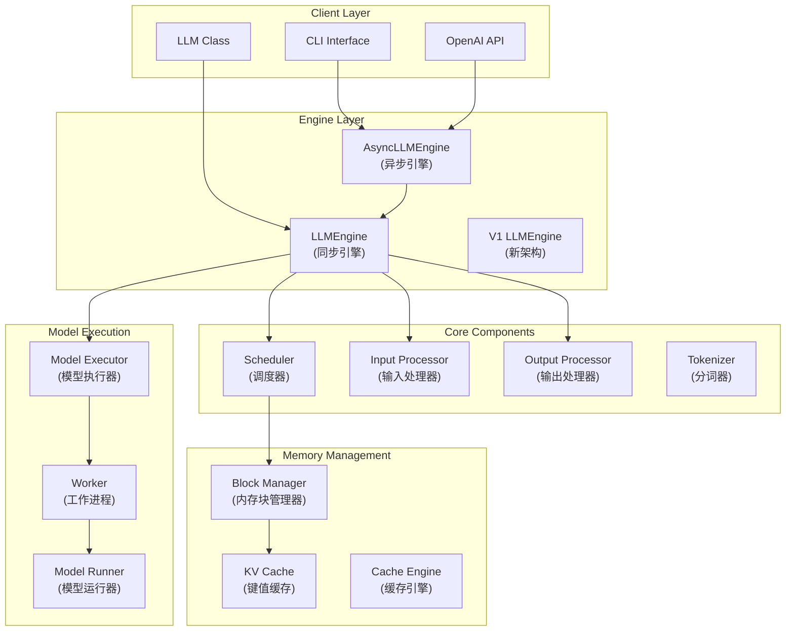
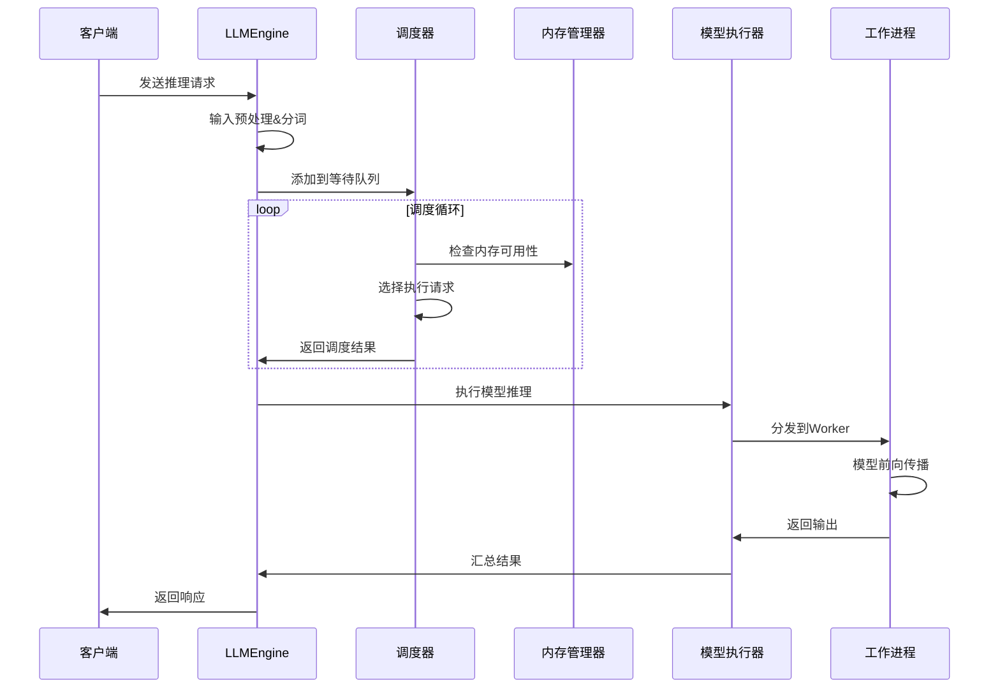

# vLLM Engine 架构与开发教程

## 目录
- [概述](#概述)
- [架构图解](#架构图解)
- [核心组件详解](#核心组件详解)
- [工作流程](#工作流程)
- [开发指南](#开发指南)
- [常见问题](#常见问题)

## 概述

vLLM是一个高性能的大语言模型推理引擎，采用PagedAttention技术实现高效的内存管理和请求调度。本教程将帮助你深入理解vLLM的架构设计，并掌握参与开发的关键知识。

### 核心特性
- 🚀 **高吞吐量**: 连续批处理 + PagedAttention
- 💾 **内存高效**: 动态内存分配 + KV缓存优化  
- 🔄 **智能调度**: 多队列管理 + 前缀缓存
- 🌐 **分布式**: 张量并行 + 流水线并行
- 🔌 **易集成**: OpenAI兼容API

## 架构图解

### 1. 整体系统架构



### 2. 请求处理流程



## 核心组件详解

### 1. LLMEngine (引擎核心)
**位置**: `vllm/engine/llm_engine.py`

```python
class LLMEngine:
    """vLLM的核心引擎，负责协调所有组件"""
    
    def __init__(self, vllm_config, executor_class, ...):
        # 初始化分词器
        self.tokenizer = self._init_tokenizer()
        # 初始化调度器
        self.scheduler = Scheduler(...)
        # 初始化模型执行器
        self.model_executor = executor_class(...)
        # 初始化输入/输出处理器
        self.input_preprocessor = InputPreprocessor(...)
        self.output_processor = SequenceGroupOutputProcessor(...)
    
    def step(self) -> List[RequestOutput]:
        """执行一次推理步骤"""
        # 1. 调度请求
        seq_group_metadata_list, scheduler_outputs = self.scheduler.schedule()
        # 2. 执行模型
        output = self.model_executor.execute_model(...)
        # 3. 处理输出
        return self.output_processor.process_outputs(...)
```

**关键职责**:
- 协调各个组件工作
- 管理请求生命周期
- 控制推理流程

#### LLMEngine.step() - 核心执行方法 🔥

`step()` 是vLLM最关键的方法，执行**调度-执行-处理**的完整周期：

**重要概念澄清**: `step()` **不是**只decode一个token，而是处理整个batch的一次完整推理迭代

**三大核心阶段**:
1. **调度阶段**: 选择请求、分配内存、决定swap操作  
2. **执行阶段**: GPU推理计算（attention + FFN）
3. **处理阶段**: 解码文本、更新状态、检查完成条件

```python
def step(self) -> List[RequestOutput]:
    # 阶段1: 调度 - 选择要执行的请求
    if not self._has_remaining_steps():
        seq_group_metadata_list, scheduler_outputs = self.scheduler.schedule()
    
    # 阶段2: 执行 - 运行模型推理  
    if not scheduler_outputs.is_empty():
        outputs = self.model_executor.execute_model(execute_model_req)
    
    # 阶段3: 处理 - 生成最终输出
    request_outputs = self._process_model_outputs(outputs)
    return request_outputs
```

**每次step可能包含**:
- 新请求的prefill（处理完整prompt）
- 现有请求的decode（生成新token）
- 内存管理操作（swap in/out）
- 多个请求的batch处理

详细解析: 
- [→ Engine Step方法深度解析](engine-step-analysis.md)
- [→ Step方法技术细节深入解析](step-technical-details.md)
- [→ **Step源代码逐行解析**](step-source-code-analysis.md) ⭐
- [→ Step使用示例代码](examples/step_usage_example.py)

### 2. Scheduler (调度器)
**位置**: `vllm/core/scheduler.py`

```python
class Scheduler:
    """智能请求调度器"""
    
    def __init__(self, scheduler_config, cache_config, ...):
        # 三个队列管理不同状态的请求
        self.waiting: Deque[SequenceGroup] = deque()  # 等待队列
        self.running: Deque[SequenceGroup] = deque()  # 运行队列  
        self.swapped: Deque[SequenceGroup] = deque()  # 交换队列
        # 内存管理
        self.block_manager = BlockSpaceManager(...)
    
    def schedule(self) -> Tuple[List[SequenceGroupMetadata], SchedulerOutputs]:
        """核心调度逻辑"""
        # 1. 调度运行中的请求 (decode)
        running_scheduled = self._schedule_running(budget, ...)
        # 2. 调度交换出的请求 (swap in)
        swapped_in = self._schedule_swapped(budget, ...)
        # 3. 调度等待中的请求 (prefill)
        prefills = self._schedule_prefills(budget, ...)
        
        return seq_group_metadata_list, scheduler_outputs
```

**关键概念**:
- **WAITING**: 新来的请求，等待prefill
- **RUNNING**: 正在生成的请求，进行decode
- **SWAPPED**: 内存不足时暂存到CPU的请求

### 3. Block Manager (内存管理)
**位置**: `vllm/core/block_manager.py`

```python
class SelfAttnBlockSpaceManager:
    """PagedAttention的内存管理器"""
    
    def __init__(self, block_size, num_gpu_blocks, num_cpu_blocks, ...):
        self.block_size = block_size  # 通常是16
        self.block_allocator = CpuGpuBlockAllocator.create(...)
        self.block_tables: Dict[SeqId, BlockTable] = {}
        
    def allocate(self, seq_group: SequenceGroup) -> None:
        """为序列组分配内存块"""
        for seq in seq_group.get_seqs():
            block_table = self._allocate_sequence(seq)
            self.block_tables[seq.seq_id] = block_table
    
    def can_append_slots(self, seq_group, num_lookahead_slots) -> bool:
        """检查是否有足够内存继续生成"""
        # 计算需要的新块数量
        # 检查GPU空闲块数量
        return num_touched_blocks <= num_free_gpu_blocks
```

**PagedAttention优势**:
- 消除内存碎片
- 支持动态序列长度
- 实现内存共享(prefix caching)

### 4. Model Executor (模型执行)
**位置**: `vllm/executor/`

```python
# 单进程执行器
class UniProcExecutor(ExecutorBase):
    def execute_model(self, execute_model_req) -> List[SamplerOutput]:
        return self.driver_worker.execute_model(execute_model_req)

# 多进程执行器  
class MultiprocessingDistributedExecutor(DistributedExecutorBase):
    def execute_model(self, execute_model_req) -> List[SamplerOutput]:
        # 并行执行
        driver_outputs = self._driver_execute_model(execute_model_req)
        return driver_outputs
```

**支持的执行模式**:
- **单进程**: 小模型或调试
- **多进程**: 张量并行
- **Ray**: 大规模分布式

## 工作流程

### 典型的推理流程

1. **请求接收**
   ```python
   # 用户发送请求
   response = llm.generate("Hello, how are you?", sampling_params)
   ```

2. **输入处理**
   ```python
   # 分词和预处理
   processed_inputs = input_preprocessor.preprocess(prompt, ...)
   seq_group = SequenceGroup(request_id, seqs, ...)
   ```

3. **调度决策**
   ```python
   # 调度器选择要执行的请求
   scheduler_outputs = scheduler.schedule()
   # 包含: prefill requests + decode requests
   ```

4. **内存分配**
   ```python
   # 分配KV cache内存块
   block_manager.allocate(seq_group)
   # 更新block tables
   ```

5. **模型执行**
   ```python
   # 批量执行模型推理
   model_outputs = model_executor.execute_model(execute_model_req)
   # 包含: attention计算 + FFN + sampling
   ```

6. **输出处理**
   ```python
   # 处理模型输出，更新序列
   request_outputs = output_processor.process_outputs(model_outputs)
   ```

### 内存管理流程

```python
# 1. 初始化时确定可用内存块数量
num_gpu_blocks, num_cpu_blocks = model_executor.determine_num_available_blocks()

# 2. 为每个序列分配block table
block_table = []
for token_chunk in sequence_tokens:
    if need_new_block:
        new_block = block_allocator.allocate()
        block_table.append(new_block)

# 3. 在attention计算中使用blocks
attention_output = paged_attention(query, key_cache, value_cache, block_tables)

# 4. 序列完成后释放blocks
block_allocator.free(completed_sequence_blocks)
```

## 开发指南

### 环境准备

```bash
# 1. 克隆代码
git clone https://github.com/vllm-project/vllm.git
cd vllm

# 2. 安装依赖
pip install -e .

# 3. 运行测试
pytest tests/ -v
```

### 常见开发任务

#### 1. 添加新的采样算法

```python
# 在 vllm/sampling_params.py 中添加新参数
@dataclass
class SamplingParams:
    my_new_param: float = 1.0

# 在 vllm/model_executor/layers/sampler.py 中实现逻辑
def _apply_my_new_sampling(logits: torch.Tensor, my_new_param: float):
    # 实现新的采样逻辑
    pass
```

#### 2. 优化调度策略

```python
# 在 vllm/core/scheduler.py 中修改调度逻辑
def _schedule_prefills(self, budget, curr_loras, ...):
    # 添加新的调度策略
    # 例如: 基于序列长度的优先级
    sorted_waiting = sorted(self.waiting, key=lambda x: len(x.prompt))
    
    for seq_group in sorted_waiting:
        if budget.can_schedule(...):
            # 调度这个序列组
            pass
```

#### 3. 添加新的Attention机制

```python
# 在 vllm/attention/ 下创建新的attention backend
class MyAttentionBackend(AttentionBackend):
    def forward(self, query, key, value, ...):
        # 实现新的attention算法
        pass

# 在 vllm/attention/__init__.py 中注册
def get_attn_backend(head_size, dtype, ...):
    if my_condition:
        return MyAttentionBackend()
```

### 调试技巧

#### 1. 启用详细日志
```bash
export VLLM_LOGGING_LEVEL=DEBUG
```

#### 2. 分析内存使用
```python
# 在代码中添加内存监控
import torch
print(f"GPU memory: {torch.cuda.memory_allocated() / 1e9:.2f} GB")
```

#### 3. 性能分析
```python
# 使用profiler
with torch.profiler.profile() as prof:
    output = model_executor.execute_model(req)
prof.export_chrome_trace("trace.json")
```

### 代码结构导航

```
vllm/
├── engine/              # 引擎核心
│   ├── llm_engine.py   # 主引擎
│   └── async_llm_engine.py
├── core/               # 核心算法
│   ├── scheduler.py    # 调度器
│   └── block_manager.py # 内存管理
├── executor/           # 执行器
│   ├── executor_base.py
│   └── ray_distributed_executor.py
├── worker/             # 工作进程
│   ├── worker.py       # 主worker
│   └── model_runner.py # 模型运行
├── attention/          # Attention实现
│   └── backends/
├── model_executor/     # 模型执行
│   └── layers/         # 模型层
└── entrypoints/        # 入口点
    ├── llm.py         # LLM类
    └── openai/        # OpenAI API
```

## 常见问题

### Q1: 如何调整内存使用？
```python
# 通过gpu_memory_utilization参数
llm = LLM(model="meta-llama/Llama-2-7b-hf", 
          gpu_memory_utilization=0.9)  # 使用90%显存
```

### Q2: 如何启用分布式推理？
```bash
# 使用tensor parallel
python -m vllm.entrypoints.openai.api_server \
    --model meta-llama/Llama-2-70b-hf \
    --tensor-parallel-size 4
```

### Q3: 如何调试调度问题？
```python
# 查看调度器状态
print(f"Waiting: {len(scheduler.waiting)}")
print(f"Running: {len(scheduler.running)}")
print(f"Swapped: {len(scheduler.swapped)}")
```

### Q4: 如何添加自定义模型？
1. 在`vllm/model_executor/models/`下添加模型实现
2. 在`vllm/model_executor/models/__init__.py`中注册
3. 确保实现必要的接口方法

---

## 总结

vLLM通过精心设计的架构实现了高效的LLM推理：

- **分层设计**: 清晰的职责分离
- **智能调度**: 多队列 + 内存感知
- **内存优化**: PagedAttention + 前缀缓存
- **分布式**: 支持多种并行策略
- **易扩展**: 模块化的组件设计

掌握这些核心概念后，你就可以开始参与vLLM的开发了！建议从小的功能改进开始，逐步深入核心组件。 