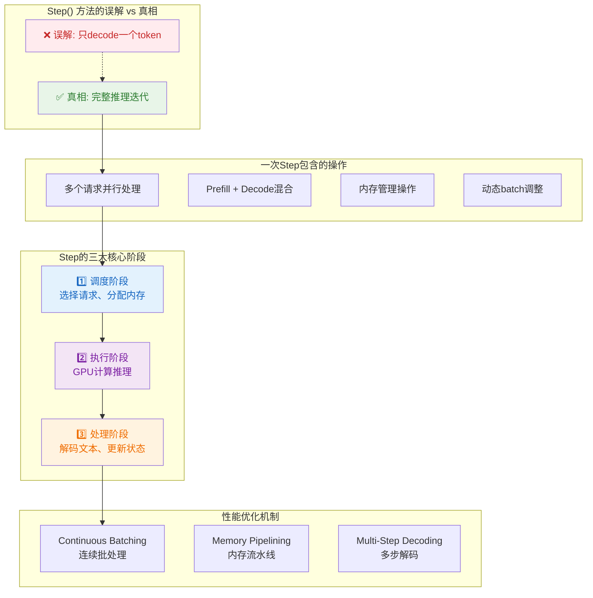
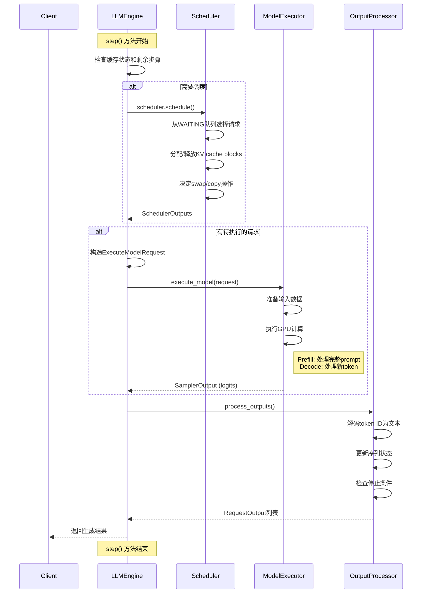

# vLLM Step方法技术细节深入解析

## 问题答疑

### Q: step是只decode一个步不断step直到结束吗？

**答案：不是！** 这是对vLLM step方法的一个常见误解。

`step()` 方法执行的是一次**完整的推理迭代**，在一次step中可能发生：

1. **Batch处理**: 同时处理多个请求
2. **混合操作**: 一些请求进行prefill，一些进行decode
3. **变长生成**: 每次step可能生成不同数量的token
4. **内存管理**: 处理swap、分配、释放等操作

## Step方法的实际执行模式

### 模式1: 单请求完整流程
```python
# 第1次step: Prefill阶段
request_outputs = engine.step()  
# 处理: "Hello, how are you?" → 生成第1个token

# 第2次step: Decode阶段  
request_outputs = engine.step()
# 处理: 基于之前context → 生成第2个token

# 第3-N次step: 继续Decode
# 直到遇到停止条件(EOS, max_length等)
```

### 模式2: 多请求并行处理
```python
# 添加多个请求
engine.add_request("req1", "Tell me a story", sampling_params)
engine.add_request("req2", "What is AI?", sampling_params)  
engine.add_request("req3", "Hello", sampling_params)

# 第1次step: 可能同时进行
step_output = engine.step()
# req1: prefill "Tell me a story" → 第1个token
# req2: prefill "What is AI?" → 第1个token  
# req3: prefill "Hello" → 第1个token (可能已完成)

# 第2次step: 状态不同
step_output = engine.step()
# req1: decode → 第2个token
# req2: decode → 第2个token
# req3: 已完成，不在batch中
```

### 模式3: 动态batch变化
```python
# step过程中可能发生:
step_outputs = engine.step()

for output in step_outputs:
    if output.finished:
        print(f"请求{output.request_id}完成")
        # 这个请求从batch中移除
    else:
        print(f"请求{output.request_id}继续: {output.outputs[0].text}")
        # 这个请求继续留在batch中

# 新请求可以随时加入
engine.add_request("new_req", "Another prompt", params)
```

## 详细的Step执行流程

### 第一阶段: 调度决策

```python
# 调度器的核心逻辑
def schedule(self) -> Tuple[List[SequenceGroupMetadata], SchedulerOutputs]:
    budget = SchedulingBudget(
        token_budget=self._budget_config.max_num_batched_tokens,
        max_num_seqs=self._budget_config.max_num_seqs,
    )
    
    # 1. 优先处理RUNNING队列(decode阶段)
    running_scheduled = self._schedule_running(budget, curr_loras, policy)
    
    # 2. 尝试swap in一些SWAPPED请求
    swapped_in = self._schedule_swapped(budget, curr_loras, policy)
    
    # 3. 最后调度WAITING队列(prefill阶段)  
    prefills = self._schedule_prefills(budget, curr_loras, policy)
    
    return seq_group_metadata_list, scheduler_outputs
```

**调度的智能性体现在**:
- **优先级**: decode > swap_in > prefill
- **资源感知**: 根据GPU内存和计算能力动态调整
- **公平性**: 避免某些请求长期等待

### 第二阶段: 模型执行

```python
def execute_model(self, execute_model_req: ExecuteModelRequest) -> List[SamplerOutput]:
    # 1. 准备输入数据
    model_input = self.prepare_model_input(execute_model_req.seq_group_metadata_list)
    
    # 2. 执行forward pass
    hidden_states = self.model.forward(
        input_ids=model_input.input_tokens,
        positions=model_input.input_positions,
        kv_caches=self.gpu_cache,
        attn_metadata=model_input.attn_metadata,
    )
    
    # 3. 采样获得next tokens
    logits = self.model.compute_logits(hidden_states, sampling_metadata)
    output = self.sample(logits, sampling_metadata)
    
    return [output]
```

**模型执行的关键点**:
- **Prefill vs Decode**: 不同的attention计算模式
- **KV Cache管理**: 复用历史计算结果
- **并行计算**: 充分利用GPU的并行能力

### 第三阶段: 输出处理

```python
def _process_model_outputs(self, ctx: SchedulerContext) -> None:
    while ctx.output_queue:
        output_data = ctx.output_queue.popleft()
        
        # 解码token为文本
        for seq_group, outputs in zip(seq_group_metadata_list, sampler_outputs):
            for seq in seq_group.get_seqs():
                # 更新序列状态
                seq.append_token_id(sample.output_token, sample.logprobs)
                
                # 检查停止条件
                if self._is_sequence_finished(seq, sampling_params):
                    seq.status = SequenceStatus.FINISHED_STOPPED
                    
        # 生成RequestOutput  
        request_outputs.append(self._create_request_output(...))
```

## Step的性能优化机制

### 1. Continuous Batching
```python
# 传统方式: 等待整个batch完成
while batch_not_empty:
    outputs = process_entire_batch()  # 必须等所有请求完成
    
# vLLM方式: 连续batching
while engine.has_unfinished_requests():
    outputs = engine.step()  # 完成的请求立即返回，新请求立即加入
```

### 2. Memory Pipelining
```python
# 在model执行的同时准备下一步的内存操作
async def optimized_step():
    # 并行进行
    model_task = asyncio.create_task(execute_model())
    memory_task = asyncio.create_task(prepare_next_memory_ops())
    
    model_output = await model_task
    await memory_task  # 确保内存操作完成
```

### 3. Multi-Step Decoding
```python
# 启用multi-step后，一次step可能生成多个token
scheduler_config.is_multi_step = True
scheduler_config.max_num_steps = 4  # 最多4步

# 单次step可能的输出
step_output = engine.step()
# 某个序列: "Hello" → "Hello world how are"  (生成了3个token)
```

## 实际应用示例

### 示例1: 观察Step的工作过程
```python
import time
from vllm import LLMEngine, EngineArgs, SamplingParams

engine = LLMEngine.from_engine_args(EngineArgs(model="gpt2"))

# 添加不同长度的请求
engine.add_request("short", "Hi", SamplingParams(max_tokens=5))
engine.add_request("long", "Write a story", SamplingParams(max_tokens=100))

step_count = 0
while engine.has_unfinished_requests():
    step_count += 1
    start = time.time()
    
    outputs = engine.step()
    step_time = time.time() - start
    
    print(f"Step {step_count} ({step_time:.3f}s):")
    for output in outputs:
        status = "完成" if output.finished else "继续"
        print(f"  {output.request_id}: {status} - {output.outputs[0].text}")
```

### 示例2: 动态添加请求
```python
# 模拟在线服务场景
async def online_service_simulation():
    engine = LLMEngine.from_engine_args(EngineArgs(model="gpt2"))
    
    # 模拟客户端请求陆续到达
    async def add_requests():
        for i in range(10):
            await asyncio.sleep(0.1)  # 模拟请求间隔
            engine.add_request(f"req_{i}", f"Query {i}", SamplingParams(max_tokens=20))
    
    # 启动请求添加任务
    request_task = asyncio.create_task(add_requests())
    
    # 主处理循环
    while engine.has_unfinished_requests() or not request_task.done():
        outputs = engine.step()
        
        for output in outputs:
            if output.finished:
                print(f"完成: {output.request_id} - {output.outputs[0].text}")
        
        await asyncio.sleep(0.01)  # 小延迟避免busy loop
```

## 调试和监控

### 监控Step性能
```python
class StepMonitor:
    def __init__(self):
        self.step_times = []
        self.batch_sizes = []
        self.memory_usage = []
    
    def monitor_step(self, engine):
        start = time.time()
        
        # 记录step前状态
        batch_size = sum(len(scheduler.running) for scheduler in engine.scheduler)
        
        outputs = engine.step()
        
        # 记录性能数据
        step_time = time.time() - start
        self.step_times.append(step_time)
        self.batch_sizes.append(batch_size)
        
        return outputs
    
    def report(self):
        print(f"平均step时间: {np.mean(self.step_times):.3f}s")
        print(f"平均batch大小: {np.mean(self.batch_sizes):.1f}")
        print(f"吞吐量: {np.mean(self.batch_sizes) / np.mean(self.step_times):.1f} req/s")
```

## 总结

**Step方法的本质**:
- **不是单token操作**: 而是完整的推理迭代
- **支持batch处理**: 同时处理多个请求  
- **智能调度**: 根据资源状况动态调整
- **高效执行**: 充分利用GPU并行能力
- **连续优化**: 避免等待，最大化吞吐量

理解了step方法，就理解了vLLM高性能的核心秘密：**智能调度 + 高效批处理 + 优化内存管理**。 


## 图




```mermaid
graph TD
    A["step() 开始"] --> B{"检查是否有剩余步骤?"}
    B -->|否| C["阶段1: 调度 (Schedule)"]
    B -->|是| R["返回cached输出<br/>(Multi-step)"]
    
    C --> D["调度器选择请求"]
    D --> E["决定内存操作<br/>(swap/copy)"]
    E --> F["检查调度结果是否为空?"]
    
    F -->|非空| G["阶段2: 模型执行"]
    F -->|空| O["跳过执行"]
    
    G --> H["构造ExecuteModelRequest"]
    H --> I["model_executor.execute_model()"]
    I --> J["GPU计算<br/>(Attention + FFN)"]
    J --> K["返回logits/采样结果"]
    
    K --> L["阶段3: 输出处理"]
    O --> L
    
    L --> M["解码token为文本"]
    M --> N["更新序列状态"]
    N --> P["检查停止条件"]
    P --> Q["创建RequestOutput"]
    Q --> S["返回输出列表"]
    
    style A fill:#e1f5fe
    style C fill:#f3e5f5
    style G fill:#e8f5e8
    style L fill:#fff3e0
    style S fill:#e1f5fe
'''
