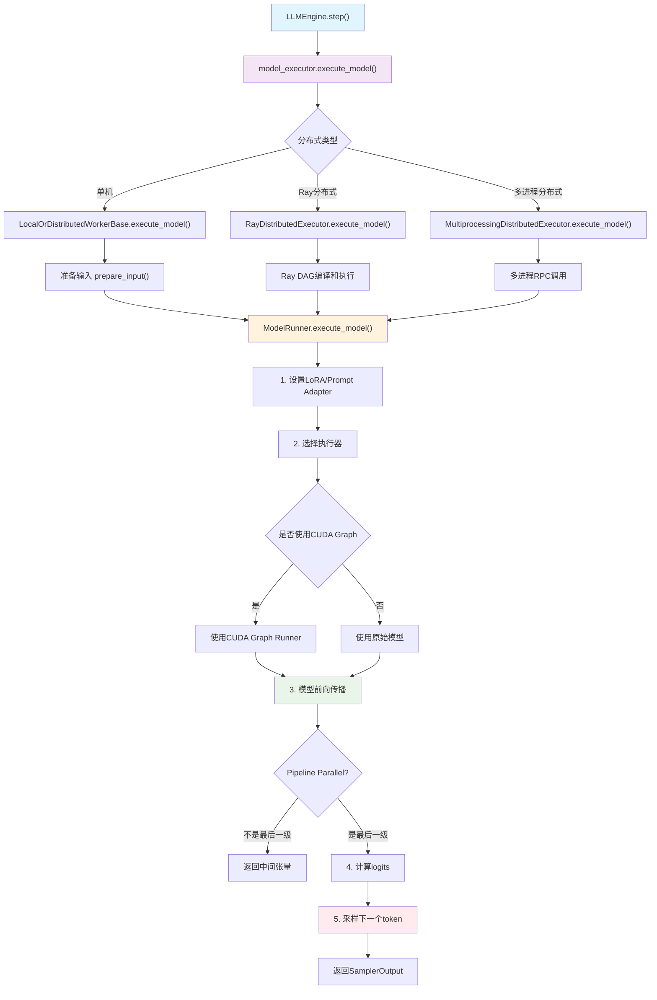
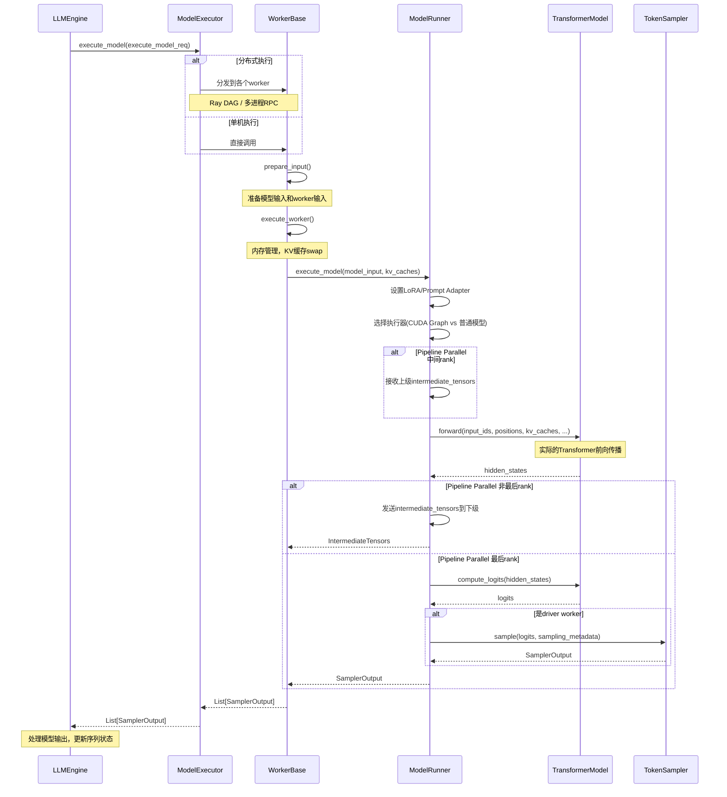

# Execute Model 详解

`execute_model` 是 vLLM 引擎的核心执行组件，负责实际的模型推理。这个过程包含了模型前向传播、内存管理、分布式协调等关键步骤。

## 1. 执行流程概览

### 1.1 调用链路
```
LLMEngine.step() 
    → model_executor.execute_model() 
    → WorkerBase.execute_model() 
    → ModelRunner.execute_model() 
    → 实际模型推理
```

### 1.2 关键参数
```python
execute_model_req = ExecuteModelRequest(
    seq_group_metadata_list=seq_group_metadata_list,  # 序列组元数据
    blocks_to_swap_in=scheduler_outputs.blocks_to_swap_in,  # 需要swap in的blocks
    blocks_to_swap_out=scheduler_outputs.blocks_to_swap_out,  # 需要swap out的blocks  
    blocks_to_copy=scheduler_outputs.blocks_to_copy,  # 需要复制的blocks
    num_lookahead_slots=scheduler_outputs.num_lookahead_slots,  # 预测slots数量
    running_queue_size=scheduler_outputs.running_queue_size,  # 运行队列大小
)
```

## 2. 分布式执行策略

### 2.1 执行器类型

根据配置选择不同的执行器：

#### 单机执行器
```python
class LocalOrDistributedWorkerBase(WorkerBase):
    def execute_model(self, execute_model_req):
        # 1. 准备输入
        inputs = self.prepare_input(execute_model_req)
        model_input, worker_input, kwargs = inputs
        
        # 2. 执行worker逻辑
        self.execute_worker(worker_input)
        
        # 3. 实际模型执行
        output = self.model_runner.execute_model(
            model_input=model_input,
            kv_caches=self.kv_cache[worker_input.virtual_engine],
            intermediate_tensors=intermediate_tensors,
            num_steps=num_steps,
            **kwargs,
        )
```

#### Ray分布式执行器
```python
class RayDistributedExecutor(DistributedExecutorBase):
    def execute_model(self, execute_model_req):
        # 使用Ray编译DAG进行分布式执行
        if self.forward_dag is None:
            self.forward_dag = self._compiled_ray_dag(enable_asyncio=False)
        
        # 序列化数据并执行
        serialized_data = self.input_encoder.encode(execute_model_req)
        outputs = ray.get(self.forward_dag.execute(serialized_data))
        return self.output_decoder.decode(outputs[0])
```

### 2.2 Pipeline Parallel处理

对于Pipeline Parallel，不同rank处理不同的逻辑：

```python
# 中间rank：处理中间层，传递隐藏状态
if not get_pp_group().is_first_rank:
    intermediate_tensors = IntermediateTensors(
        get_pp_group().recv_tensor_dict(all_gather_group=get_tp_group())
    )

# 最后rank：计算logits和采样
if not get_pp_group().is_last_rank:
    # 发送中间张量到下一级
    get_pp_group().send_tensor_dict(output.tensors, all_gather_group=get_tp_group())
    return [None]
```

## 3. ModelRunner.execute_model() 详解

这是实际执行模型推理的核心方法：

### 3.1 前置准备

```python
@torch.inference_mode()
def execute_model(self, model_input, kv_caches, intermediate_tensors=None, num_steps=1):
    # 1. 设置LoRA适配器
    if self.lora_config:
        self.set_active_loras(model_input.lora_requests, model_input.lora_mapping)
    
    # 2. 设置Prompt适配器  
    if self.prompt_adapter_config:
        self.set_active_prompt_adapters(
            model_input.prompt_adapter_requests, 
            model_input.prompt_adapter_mapping
        )
    
    # 3. 开始注意力状态管理
    self.attn_state.begin_forward(model_input)
```

### 3.2 选择执行器

根据是否使用CUDA Graph选择不同的执行器：

```python
# 检查是否可以使用CUDA Graph（仅支持decode阶段）
prefill_meta = model_input.attn_metadata.prefill_metadata
decode_meta = model_input.attn_metadata.decode_metadata

if prefill_meta is None and decode_meta.use_cuda_graph:
    # 使用CUDA Graph加速
    graph_batch_size = model_input.input_tokens.shape[0]
    use_inputs_embeds = model_input.inputs_embeds is not None
    model_executable = self.graph_runners[virtual_engine][(graph_batch_size, use_inputs_embeds)]
else:
    # 使用普通模型执行
    model_executable = self.model
```

### 3.3 KV缓存管理

处理分布式KV缓存传输：

```python
# 接收KV缓存（分离式prefill场景）
bypass_model_exec = False
if self.need_recv_kv(model_input, kv_caches):
    hidden_or_intermediate_states, bypass_model_exec, model_input = \
        get_kv_transfer_group().recv_kv_caches_and_hidden_states(
            model_executable, model_input, kv_caches=kv_caches
        )
```

### 3.4 模型前向传播

这是核心的计算步骤：

```python
if not bypass_model_exec:
    with set_forward_context(model_input.attn_metadata, self.vllm_config, virtual_engine):
        # 实际的模型前向传播
        hidden_or_intermediate_states = model_executable(
            input_ids=model_input.input_tokens,           # 输入token ID
            inputs_embeds=model_input.inputs_embeds,      # 输入embeddings
            positions=model_input.input_positions,       # 位置编码
            intermediate_tensors=intermediate_tensors,    # 中间张量（PP使用）
            **MultiModalKwargs.as_kwargs(multi_modal_kwargs, device=self.device),  # 多模态输入
            **seqlen_agnostic_kwargs,                     # 序列长度无关参数
            **model_kwargs,                               # 其他模型参数
        )
```

### 3.5 Logits计算

在Pipeline的最后阶段计算logits：

```python
if get_pp_group().is_last_rank:  # 只在最后一个pipeline rank计算logits
    logits = self.model.compute_logits(
        hidden_or_intermediate_states, 
        model_input.sampling_metadata
    )
```

### 3.6 采样

在driver worker中进行token采样：

```python
if self.is_driver_worker:
    # 异步回调处理
    if model_input.async_callback is not None:
        model_input.async_callback()
    
    # 采样下一个token
    output: SamplerOutput = self.sampler(
        logits=logits,
        sampling_metadata=model_input.sampling_metadata,
    )
```

## 4. 性能优化策略

### 4.1 CUDA Graph

对于decode阶段，使用CUDA Graph可以大幅提升性能：

```python
class CUDAGraphRunner(nn.Module):
    def capture(self, input_ids, positions, kv_caches, attn_metadata, ...):
        # 捕获CUDA计算图
        with torch.cuda.graph(self.graph, pool=memory_pool, stream=stream):
            hidden_states = self.model(
                input_ids=input_ids,
                positions=positions,
                kv_caches=kv_caches,
                attn_metadata=attn_metadata,
                **kwargs,
            )
        # 图被捕获，后续可重复高效执行
```

### 4.2 内存管理

- **KV缓存swap**: 在GPU内存不足时，将KV缓存移到CPU内存
- **块级内存管理**: 使用PagedAttention进行高效的内存分配
- **中间张量传递**: 在Pipeline Parallel中减少通信开销

### 4.3 异步执行

```python
# 支持异步输出处理
if allow_async_output_proc:
    execute_model_req.async_callback = self.async_callbacks[virtual_engine]
```

## 5. 错误处理

```python
try:
    outputs = self.model_executor.execute_model(execute_model_req=execute_model_req)
    self._skip_scheduling_next_step = False
except InputProcessingError as e:
    # 输入处理错误，终止特定请求但继续处理其他请求
    invalid_request_id = e.request_id
    self._abort_and_cache_schedule(
        request_id=invalid_request_id,
        virtual_engine=virtual_engine,
        seq_group_metadata_list=seq_group_metadata_list,
        scheduler_outputs=scheduler_outputs,
        allow_async_output_proc=allow_async_output_proc
    )
    raise
```

## 6. 监控和观察

### 6.1 性能指标收集

```python
# 模型前向传播时间
if self.observability_config.collect_model_forward_time:
    model_forward_start = torch.cuda.Event(enable_timing=True)
    model_forward_end = torch.cuda.Event(enable_timing=True)
    model_forward_start.record()
    # ... 模型执行 ...
    model_forward_end.record()
    
    model_forward_time = model_forward_start.elapsed_time(model_forward_end)
    output.model_forward_time = model_forward_time
```

### 6.2 执行时间统计

```python
# 总执行时间
model_execute_time = time.perf_counter() - start_time
if output is not None:
    for o in output:
        o.model_execute_time = model_execute_time
```

## 7. 关键数据结构

### 7.1 ExecuteModelRequest
包含了执行模型所需的所有信息：
- `seq_group_metadata_list`: 序列组元数据列表  
- `blocks_to_swap_in/out`: 内存swap操作
- `blocks_to_copy`: 块复制操作
- `num_lookahead_slots`: 投机解码使用

### 7.2 ModelInput
模型的实际输入：
- `input_tokens`: 输入token IDs
- `input_positions`: 位置编码
- `attn_metadata`: 注意力元数据
- `kv_caches`: KV缓存张量

### 7.3 SamplerOutput
采样器的输出：
- `outputs`: 每个序列组的输出
- `sampled_token_ids`: 采样得到的token IDs
- `logprobs`: log概率
- `model_forward_time`: 前向传播时间

## 8. 总结

`execute_model` 是vLLM引擎的核心，它协调了：

1. **分布式执行**: 支持单机、Ray、多进程等多种分布式策略
2. **内存管理**: 高效的KV缓存和内存swap机制  
3. **性能优化**: CUDA Graph、异步执行等优化技术
4. **模型推理**: 实际的Transformer前向传播和采样
5. **错误处理**: 健壮的错误恢复机制

这个过程确保了vLLM能够高效、稳定地服务大语言模型推理请求。 

## 9. 图



