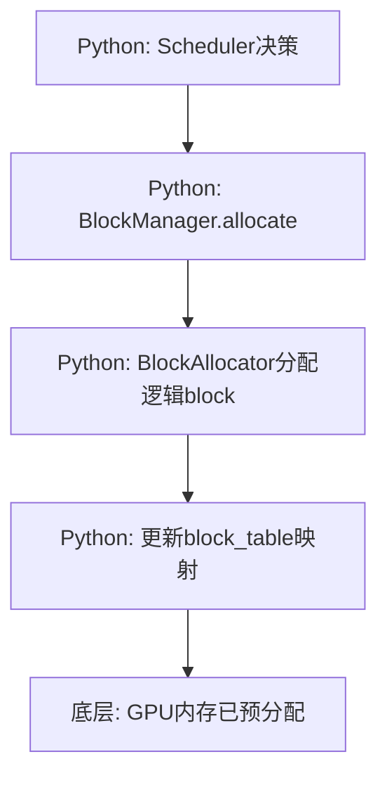
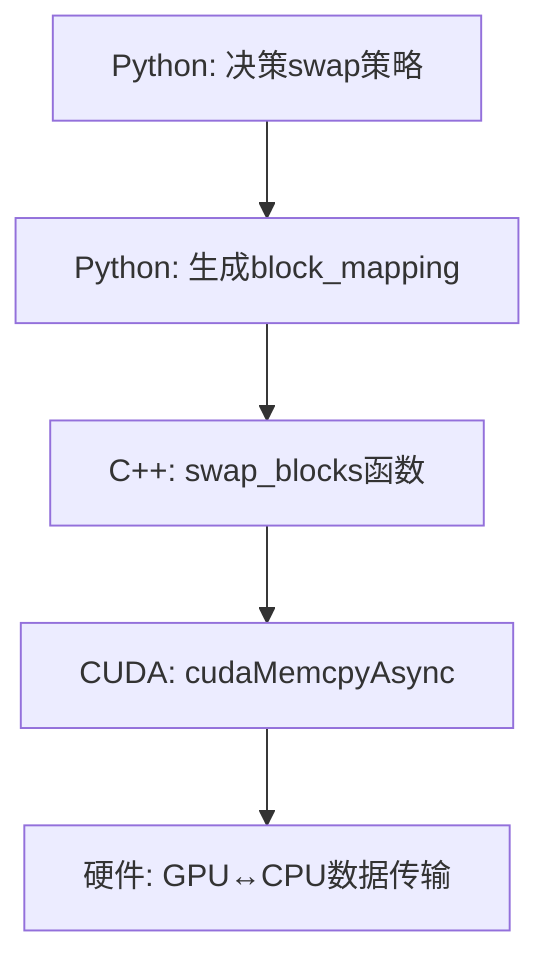
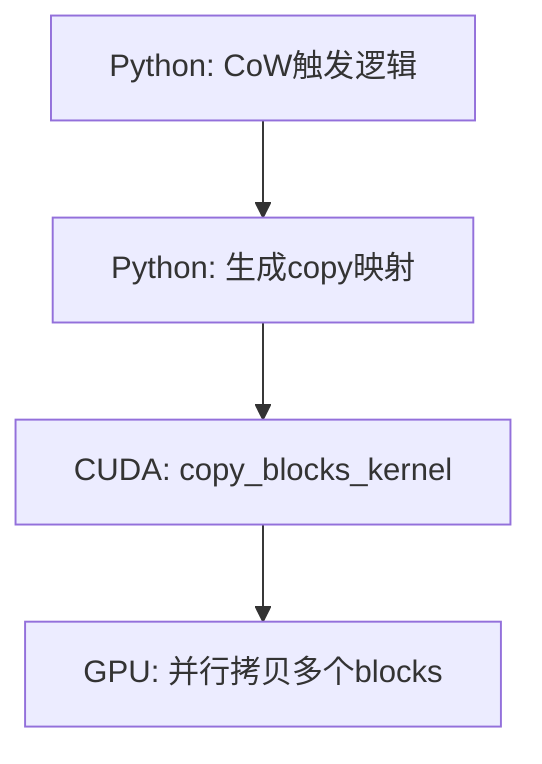
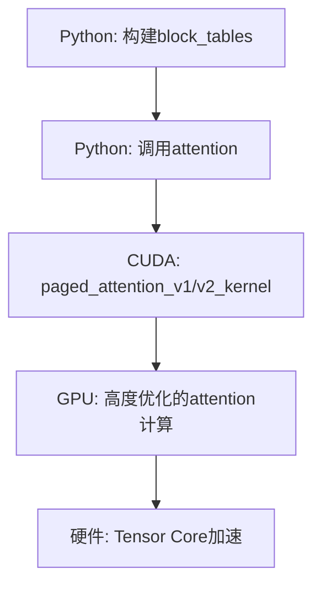
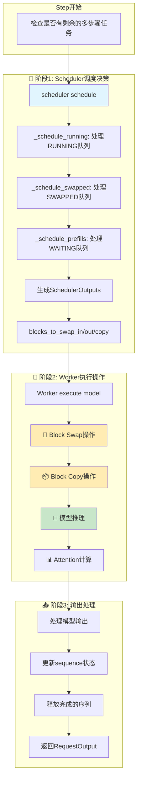
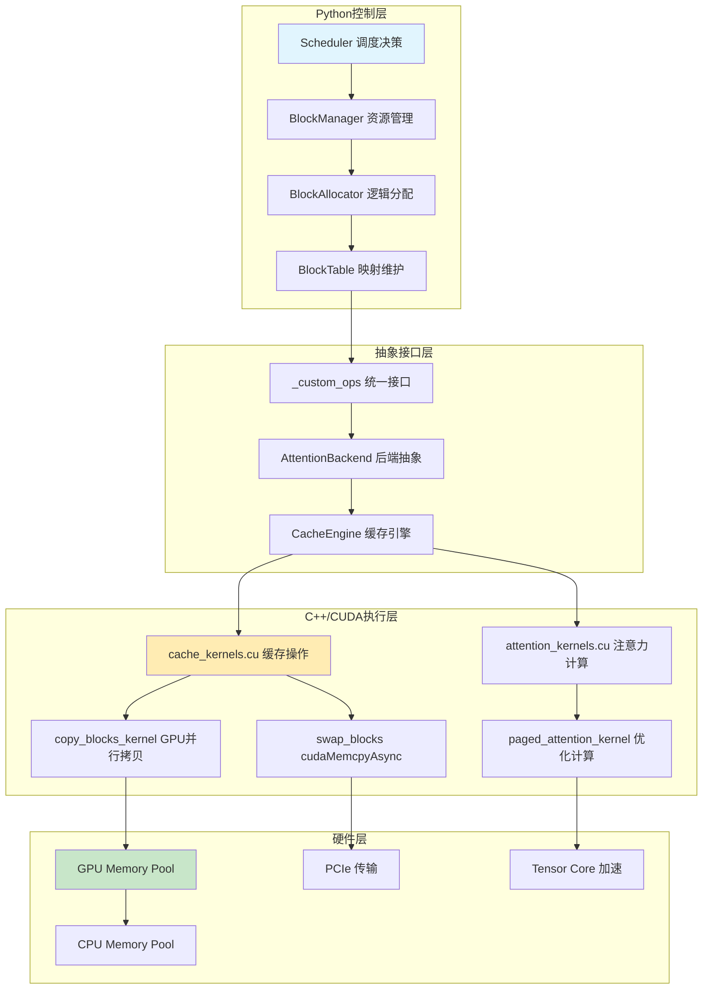
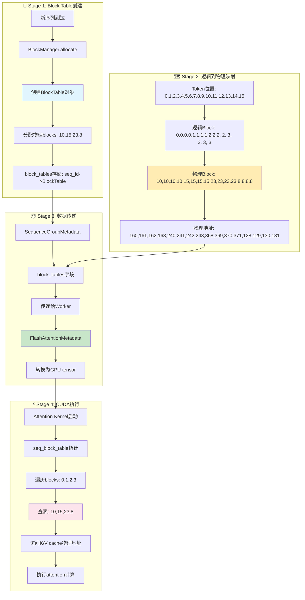

# vLLM Paged Attention 内存管理深度分析

## 核心问题：哪些是Python管理，哪些是底层实现？

vLLM的paged attention内存管理是一个**多层混合架构**，**不是完全通过Python管理的**。让我详细为您分解各个层次：

## 🏗️ 架构分层

### 1. Python控制层 (顶层决策)
**位置**: `vllm/core/block_manager.py`, `vllm/core/block/cpu_gpu_block_allocator.py`

**职责**: 
- 📋 **逻辑决策**: 何时分配、释放、交换block
- 🧮 **资源规划**: 计算需要多少blocks，watermark策略
- 🔄 **调度协调**: 与scheduler集成，管理block_table映射

```python
# Python层的典型操作
class SelfAttnBlockSpaceManager:
    def allocate(self, seq_group: SequenceGroup) -> None:
        # Python计算需要多少blocks
        num_required_blocks = BlockTable.get_num_required_blocks(...)
        # Python调用底层分配器
        block_table.allocate(token_ids=seq.get_token_ids())
    
    def swap_out(self, seq_group: SequenceGroup) -> List[Tuple[int, int]]:
        # Python决策哪些blocks要swap
        seq_swap_mapping = self.block_allocator.swap(blocks=blocks,
                                                     src_device=Device.GPU,
                                                     dst_device=Device.CPU)
```

### 2. 中间抽象层 (接口桥接)
**位置**: `vllm/_custom_ops.py`, `vllm/attention/backends/`

**职责**:
- 🌉 **接口统一**: 为不同后端（CUDA/ROCm/CPU）提供统一接口
- 🎯 **参数转换**: 将Python对象转换为tensor操作
- 📊 **设备管理**: 处理GPU/CPU设备切换

```python
def swap_blocks(src: torch.Tensor, dst: torch.Tensor,
                block_mapping: torch.Tensor) -> None:
    # 统一接口，底层路由到具体实现
    torch.ops._C_cache_ops.swap_blocks(src, dst, block_mapping)
```

### 3. C++/CUDA内核层 (底层执行)
**位置**: `csrc/cache_kernels.cu`, `csrc/attention/attention_kernels.cuh`

**职责**:
- ⚡ **高性能执行**: GPU并行处理实际的内存操作
- 🔗 **硬件优化**: 利用CUDA shared memory、warp操作
- 📦 **批量处理**: 一次处理多个blocks的拷贝/交换

```cpp
// C++/CUDA层的实际执行
void swap_blocks(torch::Tensor& src, torch::Tensor& dst,
                 const torch::Tensor& block_mapping) {
    // 实际的GPU内存拷贝操作
    for (size_t i = 0; i < num_blocks; i++) {
        cudaMemcpyAsync(dst_ptr + dst_offset, src_ptr + src_offset,
                        block_size_in_bytes, memcpy_type, stream);
    }
}
```

## 🔄 具体操作的实现层次

### Block分配 (Allocation)


**特点**: 主要在Python层，因为分配是逻辑操作（更新映射表），物理内存已预分配。

### Block交换 (Swapping)


**特点**: Python决策 + C++/CUDA执行，涉及真实的硬件内存操作。

### Block拷贝 (Copy-on-Write)


**特点**: 完全GPU并行化，Python只负责触发。

### PagedAttention计算


**特点**: Python传递元数据，核心计算完全在GPU。

## 💾 内存管理的具体分工

### Python负责的部分
1. **逻辑block ID管理**
   ```python
   # 逻辑ID到物理ID的映射
   self.block_tables: Dict[SeqId, BlockTable] = {}
   ```

2. **资源预算和策略**
   ```python
   # 计算watermark，决策是否可以分配
   if num_free_gpu_blocks - num_required_blocks >= self.watermark_blocks:
       return AllocStatus.OK
   ```

3. **设备间调度决策**
   ```python
   # 决定哪些blocks需要swap
   seq_swap_mapping = self.block_allocator.swap(blocks=blocks,
                                                src_device=Device.GPU,
                                                dst_device=Device.CPU)
   ```

### C++/CUDA负责的部分
1. **物理内存操作**
   ```cpp
   // 实际的内存拷贝
   cudaMemcpyAsync(dst_ptr + dst_offset, src_ptr + src_offset,
                   block_size_in_bytes, memcpy_type, stream);
   ```

2. **高性能attention计算**
   ```cpp
   // 优化的paged attention kernel
   __global__ void paged_attention_v1_kernel(
       scalar_t* out, const scalar_t* q, 
       const cache_t* k_cache, const cache_t* v_cache,
       const int* block_tables, ...);
   ```

3. **GPU并行处理**
   ```cpp
   // 多block并行拷贝
   template <typename scalar_t>
   __global__ void copy_blocks_kernel(...) {
       // 每个GPU thread处理一部分数据
   }
   ```

## 🎯 关键设计理念

### 1. **预分配策略**
- GPU/CPU内存在初始化时就分配好固定大小的block池
- Python只管理逻辑ID，避免频繁的malloc/free

### 2. **异步执行**
- Python快速返回，实际内存操作在GPU stream中异步执行
- 利用CUDA stream并行化多个操作

### 3. **零拷贝优化**
- block_table只存储指针，不拷贝实际数据
- Copy-on-Write机制减少不必要的内存拷贝

### 4. **设备感知**
- 不同设备(GPU/CPU)有专门的allocator
- 跨设备操作通过专门的swap机制

## 📊 性能分析

| 操作类型 | Python开销 | C++/CUDA开销 | 主要瓶颈 |
|---------|-----------|-------------|---------|
| Block分配 | 高(映射表操作) | 低 | Python逻辑 |
| Block释放 | 高(清理映射) | 低 | Python逻辑 |
| Block交换 | 低(生成映射) | 高 | PCIe带宽 |
| Attention计算 | 极低 | 高 | GPU计算 |
| CoW拷贝 | 极低 | 中 | GPU内存带宽 |

## 🔗 完整源码链路展示：Block Swap操作

为了让您更深入理解vLLM的分层架构，让我以**Block Swap操作**为例，展示从Python决策到CUDA执行的完整实现链路：

### 第1层：Python调度层 - 决策触发

**文件**: `vllm/core/scheduler.py`

```python
def _swap_out(
    self,
    seq_group: SequenceGroup,
    blocks_to_swap_out: List[Tuple[int, int]],
) -> None:
    """将sequence group从GPU换出到CPU"""
    # 检查是否可以swap out（CPU内存是否足够）
    if not self.block_manager.can_swap_out(seq_group):
        # 无法swap，需要recompute
        self._preempt_by_recompute(seq_group)
        return
    
    # 触发实际的swap操作，获取block映射
    mapping = self.block_manager.swap_out(seq_group)
    blocks_to_swap_out.extend(mapping)  # 记录需要swap的block对
    
    # 更新sequence状态
    for seq in seq_group.get_seqs(status=SequenceStatus.RUNNING):
        seq.status = SequenceStatus.SWAPPED
        self._add_seq_group_to_swapped(seq_group)
```

**关键作用**: 
- 🧠 **决策是否swap**: 检查CPU内存容量
- 📋 **触发swap操作**: 调用block_manager.swap_out()
- 🔄 **状态管理**: 更新sequence状态为SWAPPED

---

### 第2层：Python Block管理层 - 逻辑映射

**文件**: `vllm/core/block_manager.py`

```python
def swap_out(self, seq_group: SequenceGroup) -> List[Tuple[int, int]]:
    """将sequence group的blocks从GPU换出到CPU
    
    Returns:
        List[Tuple[int, int]]: GPU block id -> CPU block id的映射列表
    """
    physical_block_id_mapping = []
    
    # 遍历该sequence group中所有RUNNING状态的sequence
    for seq in seq_group.get_seqs(status=SequenceStatus.RUNNING):
        blocks = self.block_tables[seq.seq_id].blocks
        if len(blocks) == 0:
            continue

        # 调用底层allocator执行实际的swap操作
        seq_swap_mapping = self.block_allocator.swap(
            blocks=blocks,
            src_device=Device.GPU,
            dst_device=Device.CPU
        )

        # 更新block table中的block id（从GPU id更新为CPU id）
        self.block_tables[seq.seq_id].update(blocks)

        # 将逻辑block id转换为物理block id
        seq_physical_block_id_mapping = {
            self.block_allocator.get_physical_block_id(Device.GPU, gpu_block_id):
            self.block_allocator.get_physical_block_id(Device.CPU, cpu_block_id)
            for gpu_block_id, cpu_block_id in seq_swap_mapping.items()
        }

        physical_block_id_mapping.extend(
            list(seq_physical_block_id_mapping.items())
        )

    return physical_block_id_mapping
```

**关键作用**:
- 🗺️ **逻辑映射**: 管理sequence -> blocks的映射关系
- 🔄 **设备转换**: 协调GPU和CPU之间的block转移
- 📊 **ID转换**: 将逻辑block ID转换为物理block ID

---

### 第3层：Python分配器层 - 设备协调

**文件**: `vllm/core/block/cpu_gpu_block_allocator.py`

```python
def swap(self, blocks: List[Block], src_device: Device,
         dst_device: Device) -> Dict[int, int]:
    """在设备间执行block swap操作
    
    Args:
        blocks: 要swap的block列表
        src_device: 源设备 (Device.GPU)
        dst_device: 目标设备 (Device.CPU)
    
    Returns:
        Dict[int, int]: 源block id -> 目标block id的映射
    """
    # 记录源设备中的block IDs
    src_block_ids = [block.block_id for block in blocks]
    
    # 在源设备上释放这些blocks
    self._allocators[src_device].swap_out(blocks)
    
    # 在目标设备上分配对应的blocks
    self._allocators[dst_device].swap_in(blocks)
    
    # 获取在目标设备上新分配的block IDs  
    dst_block_ids = [block.block_id for block in blocks]

    # 建立swap映射并记录到全局swap_mapping中
    current_swap_mapping: Dict[int, int] = {}
    for src_block_id, dst_block_id in zip(src_block_ids, dst_block_ids):
        if src_block_id is not None and dst_block_id is not None:
            self._swap_mapping[src_block_id] = dst_block_id
            current_swap_mapping[src_block_id] = dst_block_id
            
    return current_swap_mapping
```

**关键作用**:
- 🎛️ **设备协调**: 协调不同设备的allocator
- 📝 **映射记录**: 维护全局的swap映射关系
- ⚡ **高效转移**: 避免实际数据拷贝，只更新逻辑映射

---

### 第4层：Python Worker层 - 执行调度

**文件**: `vllm/worker/worker.py`

```python
def execute_model(
    self, 
    execute_model_req: ExecuteModelRequest
) -> Optional[List[Union[SamplerOutput, PoolerOutput]]]:
    """执行模型推理，包括内存swap操作"""
    
    # 将swap请求转换为GPU tensor（为了高效传输到GPU）
    blocks_to_swap_out = torch.tensor(
        execute_model_req.blocks_to_swap_out,
        device="cpu", 
        dtype=torch.int64
    ).view(-1, 2)
    
    # 构建worker输入
    worker_input = WorkerInput(
        num_seq_groups=len(execute_model_req.seq_group_metadata_list),
        blocks_to_swap_out=blocks_to_swap_out,
        # ... 其他参数
    )
    
    # 执行实际的swap操作
    if (worker_input.blocks_to_swap_out is not None 
        and worker_input.blocks_to_swap_out.numel() > 0):
        self.cache_engine[virtual_engine].swap_out(
            worker_input.blocks_to_swap_out
        )
    
    # 执行模型推理
    output = self.model_runner.execute_model(...)
    return output
```

**关键作用**:
- 📦 **数据打包**: 将Python list转换为GPU tensor
- 🚀 **执行调度**: 调用cache_engine执行实际swap
- 🔗 **流程集成**: 将swap操作集成到模型执行流程中

---

### 第5层：Python缓存引擎层 - 多层处理

**文件**: `vllm/worker/cache_engine.py`

```python
def swap_out(self, src_to_dst: torch.Tensor) -> None:
    """对所有attention layers执行swap out操作
    
    Args:
        src_to_dst: shape为(num_pairs, 2)的tensor，
                   每行包含[source_block_id, dest_block_id]
    """
    # 遍历所有attention层，每层都有独立的KV cache
    for i in range(self.num_attention_layers):
        # 调用attention backend的swap_blocks方法
        # self.gpu_cache[i] 和 self.cpu_cache[i] 分别是第i层的GPU和CPU缓存
        self.attn_backend.swap_blocks(
            self.gpu_cache[i],  # 源：GPU缓存 (tuple: key_cache, value_cache)
            self.cpu_cache[i],  # 目标：CPU缓存 (tuple: key_cache, value_cache) 
            src_to_dst         # block映射关系
        )
```

**关键作用**:
- 🔄 **多层处理**: 对transformer的每个attention层都执行swap
- 🏗️ **缓存管理**: 管理每层的KV cache结构
- 🎯 **后端调用**: 将操作委托给具体的attention backend

---

### 第6层：Python操作接口层 - 统一抽象

**文件**: `vllm/_custom_ops.py`

```python
def swap_blocks(src: torch.Tensor, dst: torch.Tensor,
                block_mapping: torch.Tensor) -> None:
    """统一的block swap接口，路由到对应的底层实现
    
    Args:
        src: 源tensor（GPU上的KV cache）
        dst: 目标tensor（CPU上的KV cache）
        block_mapping: shape为(num_pairs, 2)的映射tensor
    """
    # 通过PyTorch的operator registry系统调用底层C++实现
    # 根据src和dst的device类型，自动路由到CUDA或CPU实现
    torch.ops._C_cache_ops.swap_blocks(src, dst, block_mapping)
```

**关键作用**:
- 🌉 **统一接口**: 提供设备无关的统一API
- 🎯 **自动路由**: 根据tensor device自动选择实现
- 🔧 **PyTorch集成**: 通过operator registry与C++层交互

---

### 第7层：C++ Binding层 - 接口注册

**文件**: `csrc/torch_bindings.cpp`

```cpp
TORCH_LIBRARY_EXPAND(CONCAT(TORCH_EXTENSION_NAME, _cache_ops), cache_ops) {
    // 注册swap_blocks操作到PyTorch operator registry
    cache_ops.def(
        "swap_blocks(Tensor src, Tensor! dst, Tensor block_mapping) -> ()"
    );
    
    // 为CUDA设备注册具体实现
    cache_ops.impl("swap_blocks", torch::kCUDA, &swap_blocks);
    
    // 注意：CPU版本的swap_blocks会抛出异常，因为CPU不支持此操作
}
```

**关键作用**:
- 📋 **接口注册**: 向PyTorch注册C++函数
- 🎯 **设备分发**: 为不同设备类型注册不同实现
- 🔗 **Python-C++桥接**: 连接Python调用和C++实现

---

### 第8层：CUDA实现层 - 硬件执行

**文件**: `csrc/cache_kernels.cu`

```cpp
void swap_blocks(torch::Tensor& src, torch::Tensor& dst,
                 const torch::Tensor& block_mapping) {
    // 确定内存拷贝类型（GPU->CPU, CPU->GPU, or GPU->GPU）
    torch::Device src_device = src.device();
    torch::Device dst_device = dst.device();
    cudaMemcpyKind memcpy_type;
    
    if (src_device.is_cuda() && dst_device.is_cpu()) {
        memcpy_type = cudaMemcpyDeviceToHost;  // GPU -> CPU
    } else if (src_device.is_cpu() && dst_device.is_cuda()) {
        memcpy_type = cudaMemcpyHostToDevice;  // CPU -> GPU  
    } else if (src_device.is_cuda() && dst_device.is_cuda()) {
        memcpy_type = cudaMemcpyDeviceToDevice; // GPU -> GPU
    } else {
        TORCH_CHECK(false, "Invalid device combination");
    }

    // 获取原始内存指针
    char* src_ptr = static_cast<char*>(src.data_ptr());
    char* dst_ptr = static_cast<char*>(dst.data_ptr());

    // 计算每个block的字节大小（包括padding）
    const int64_t block_size_in_bytes = src.element_size() * src.stride(0);
    
    // 设置CUDA设备和stream
    const at::cuda::OptionalCUDAGuard device_guard(
        src_device.is_cuda() ? src_device : dst_device
    );
    const cudaStream_t stream = at::cuda::getCurrentCUDAStream();
    
    // 遍历所有需要swap的block pairs
    const int64_t num_blocks = block_mapping.size(0);
    for (size_t i = 0; i < num_blocks; i++) {
        // 获取源和目标block编号
        int64_t src_block_number = block_mapping[i][0].item<int64_t>();
        int64_t dst_block_number = block_mapping[i][1].item<int64_t>();
        
        // 计算内存偏移量
        int64_t src_offset = src_block_number * block_size_in_bytes;
        int64_t dst_offset = dst_block_number * block_size_in_bytes;
        
        // 异步内存拷贝（关键的硬件操作！）
        cudaMemcpyAsync(
            dst_ptr + dst_offset,    // 目标地址
            src_ptr + src_offset,    // 源地址  
            block_size_in_bytes,     // 拷贝字节数
            memcpy_type,             // 拷贝类型
            stream                   // CUDA stream（异步执行）
        );
    }
    // 注意：这里没有cudaStreamSynchronize()，所以是完全异步的！
}
```

**关键作用**:
- 🔧 **硬件操作**: 直接调用CUDA进行内存拷贝
- ⚡ **异步执行**: 使用cudaMemcpyAsync避免阻塞
- 🎯 **设备检测**: 自动处理不同设备组合
- 📊 **批量处理**: 一次处理多个block的拷贝

---

## 🔍 调用链路总结

完整的调用链路如下：

```
1. Scheduler._swap_out()           [Python决策层]
      ↓
2. BlockManager.swap_out()         [Python逻辑层] 
      ↓
3. CpuGpuBlockAllocator.swap()     [Python分配器层]
      ↓
4. Worker.execute_model()          [Python执行层]
      ↓  
5. CacheEngine.swap_out()          [Python缓存层]
      ↓
6. _custom_ops.swap_blocks()       [Python接口层]
      ↓
7. torch.ops._C_cache_ops.swap_blocks()  [C++ Binding层]
      ↓
8. swap_blocks() in cache_kernels.cu     [CUDA执行层]
      ↓
9. cudaMemcpyAsync()               [硬件层]
```

## 🎯 关键设计亮点

### 1. **分层解耦**
- **上层**：Python负责逻辑决策、资源管理、状态维护
- **下层**：C++/CUDA负责高性能的内存操作和计算

### 2. **异步执行**
- **Python层快速返回**：不等待实际内存拷贝完成
- **CUDA异步拷贝**：`cudaMemcpyAsync`在GPU stream中并行执行
- **流水线优化**：内存拷贝与模型计算可以并行进行

### 3. **零拷贝设计**
- **逻辑swap**：Python层只更新block ID映射，不拷贝数据
- **物理swap**：只在真正需要时才调用CUDA进行实际内存传输
- **批量优化**：一次调用处理多个blocks，减少调用开销

### 4. **设备抽象**
- **统一接口**：同一个`swap_blocks()`适用于GPU↔CPU、GPU↔GPU
- **自动路由**：根据tensor device自动选择优化的实现路径
- **错误处理**：非法设备组合会被及时检测和报错

## ⏰ Block操作在Step中的具体时机

您问得很好！block操作确实是由**scheduler**在每个step中协调的，但有严格的执行时机。让我详细解释：

### Step执行的三大阶段



### 🎯 阶段1: Scheduler调度决策 (Block操作的决策阶段)

**文件**: `vllm/core/scheduler.py`

```python
def schedule(self) -> Tuple[List[SequenceGroupMetadata], SchedulerOutputs, bool]:
    """调度器的核心方法 - 决定block操作策略"""
    
    budget = SchedulingBudget(
        token_budget=self.scheduler_config.max_num_batched_tokens,
        max_num_seqs=self.scheduler_config.max_num_seqs,
    )
    
    # 1️⃣ 优先处理RUNNING队列 (可能触发swap_out)
    running_scheduled = self._schedule_running(budget, curr_loras, enable_chunking)
    # 在这里决定：哪些序列需要被preempt和swap out
    
    # 2️⃣ 尝试swap in一些SWAPPED序列
    swapped_in = self._schedule_swapped(budget, curr_loras, enable_chunking)  
    # 在这里决定：哪些序列可以从CPU swap回GPU
    
    # 3️⃣ 最后调度WAITING队列 (分配新blocks)
    prefills = self._schedule_prefills(budget, curr_loras, enable_chunking)
    # 在这里决定：哪些新请求可以开始prefill
    
    # 🔥 关键：生成block操作指令
    scheduler_outputs = SchedulerOutputs(
        blocks_to_swap_in=swapped_in.blocks_to_swap_in,     # 📥 CPU→GPU
        blocks_to_swap_out=running_scheduled.blocks_to_swap_out,  # 📤 GPU→CPU  
        blocks_to_copy=running_scheduled.blocks_to_copy,    # 📋 GPU内拷贝
        # ... 其他输出
    )
    
    return seq_group_metadata_list, scheduler_outputs, allow_async_output_proc
```

**⏰ 时机**: **Step开始时**，scheduler做出所有block操作的决策
**🧠 决策内容**:
- 📤 **Swap Out**: 哪些running序列需要换出到CPU (内存不足时)
- 📥 **Swap In**: 哪些swapped序列可以换回GPU (有空闲内存时) 
- 📋 **Copy**: 哪些blocks需要CoW拷贝 (beam search分叉时)

---

### 🚀 阶段2: Worker执行操作 (Block操作的执行阶段)

**文件**: `vllm/worker/worker.py`

```python
def execute_model(self, execute_model_req: ExecuteModelRequest):
    """Worker执行模型 - 实际执行block操作"""
    
    # 📦 数据准备：将调度决策转换为tensor
    blocks_to_swap_in = torch.tensor(execute_model_req.blocks_to_swap_in, 
                                     device="cpu", dtype=torch.int64)
    blocks_to_swap_out = torch.tensor(execute_model_req.blocks_to_swap_out,
                                      device="cpu", dtype=torch.int64) 
    blocks_to_copy = torch.tensor(execute_model_req.blocks_to_copy,
                                  device="cpu", dtype=torch.int64)
    
    # 🔄 第一步：执行Block操作 (在模型推理之前！)
    if blocks_to_swap_in.numel() > 0:
        self.cache_engine.swap_in(blocks_to_swap_in)    # 📥 CPU→GPU
        
    if blocks_to_swap_out.numel() > 0:  
        self.cache_engine.swap_out(blocks_to_swap_out)  # 📤 GPU→CPU
        
    if blocks_to_copy.numel() > 0:
        self.cache_engine.copy(blocks_to_copy)          # 📋 GPU内拷贝
    
    # 🧠 第二步：执行模型推理 (block操作完成后)
    output = self.model_runner.execute_model(
        model_input=model_input,
        kv_caches=self.kv_cache,  # 使用更新后的KV cache
        # ...
    )
    
    return output
```

**⏰ 时机**: **模型推理之前**，先执行所有block操作
**🚀 执行顺序**:
1. **Swap In** → **Swap Out** → **Copy** → **模型推理**
2. 确保KV cache在模型计算前就准备好正确的数据

---

### 📤 阶段3: 输出处理 (Block操作的清理阶段)

**文件**: `vllm/engine/llm_engine.py`

```python
def step(self) -> List[RequestOutput]:
    """Engine step的最终阶段"""
    
    # ... 前面的调度和执行 ...
    
    # 📊 处理模型输出
    request_outputs = self._process_model_outputs(
        outputs=outputs, 
        scheduler_outputs=scheduler_outputs,
        seq_group_metadata_list=seq_group_metadata_list
    )
    
    # 🗑️ 清理完成的序列 (释放blocks)
    self.scheduler.free_finished_seq_groups()
    
    return request_outputs

def free_finished_seq_groups(self) -> None:
    """释放已完成序列的blocks"""
    for seq_group in self.running[:]:
        if seq_group.is_finished():
            # 🔄 释放GPU blocks
            self._free_finished_seqs(seq_group) 
            self.running.remove(seq_group)
```

**⏰ 时机**: **Step结束时**，清理完成的序列
**🗑️ 清理操作**:
- 释放已完成序列的GPU blocks
- 更新free block计数
- 为下一个step腾出空间

---

## 🎯 关键时机总结

### Block操作的严格顺序：

```
📅 Step N开始:
├── 🎯 Scheduler决策 (0.1-1ms)
│   ├── 分析内存状况
│   ├── 决定swap_in/swap_out/copy
│   └── 生成ExecuteModelRequest
├── 🚀 Worker执行 (10-100ms)  
│   ├── 🔄 Block Swap操作 (1-10ms)
│   ├── 📦 Block Copy操作 (0.1-1ms)  
│   └── 🧠 模型推理 (10-90ms)
└── 📤 输出处理 (0.1-1ms)
    ├── 处理结果
    └── 🗑️ 清理完成的序列

📅 Step N+1开始...
```

### 💡 设计智慧

1. **🎯 决策与执行分离**: Scheduler只做决策，Worker负责执行
2. **⏰ 严格的时机控制**: Block操作总是在模型推理之前完成  
3. **🔄 异步优化**: Block swap使用CUDA stream，与后续计算并行
4. **📊 资源感知**: 根据GPU内存状况动态调整block操作策略

所以回答您的问题：**Block操作确实是由Scheduler在每个step开始时决策的，但实际执行是在Worker层，且总是在模型推理之前完成！**

## 🎯 总结

**vLLM的paged attention内存管理不是完全Python管理的**，而是：

1. **Python层**: 负责逻辑决策、资源规划、调度协调
2. **C++层**: 提供统一接口，处理设备抽象  
3. **CUDA层**: 执行高性能的实际内存操作和计算

这种**分层架构**充分发挥了各层的优势：
- Python的灵活性用于复杂逻辑
- C++的性能用于系统调用
- CUDA的并行性用于大规模计算

关键在于**Python控制策略，CUDA执行操作**，实现了高效的内存管理和计算性能的完美结合。 


## 图


## 🗺️ Block Table：Paged Attention的核心内存映射表

您问得非常好！**Block Table**确实是paged attention的核心，它就是您说的"内存table"。让我详细为您展示这个table在vLLM中的具体体现和完整工作机制。

### 📍 Block Table在vLLM中的具体位置

#### 1. **Python管理层 - 逻辑Block Table**

**文件**: `vllm/core/block_manager.py`

```python
class SelfAttnBlockSpaceManager(BlockSpaceManager):
    def __init__(self, ...):
        # 🗺️ 核心：每个sequence都有自己的block table
        self.block_tables: Dict[int, BlockTable] = {}  # seq_id -> BlockTable
        
    def allocate(self, seq_group: SequenceGroup) -> None:
        """为新序列分配block table"""
        seq = seq_group.get_seqs(status=SequenceStatus.WAITING)[0]
        
        # 🔥 创建新的block table
        block_table: BlockTable = self._allocate_sequence(seq)
        self.block_tables[seq.seq_id] = block_table  # 存储映射
        
    def get_block_table(self, seq: Sequence) -> List[int]:
        """获取序列的物理block ID列表"""
        # 🎯 返回逻辑到物理的映射
        block_ids = self.block_tables[seq.seq_id].physical_block_ids
        return block_ids  # [物理block0, 物理block1, 物理block2, ...]
```

#### 2. **数据传递层 - SequenceGroupMetadata**

**文件**: `vllm/sequence.py`

```python
class SequenceGroupMetadata:
    """传递给Worker的元数据，包含block table"""
    
    # 🗺️ 核心：block tables字段
    block_tables: dict[int, list[int]]  # seq_id -> [physical_block_ids]
    
    # 示例：
    # block_tables = {
    #     seq_id_1: [10, 15, 23, 8],   # 序列1的物理blocks
    #     seq_id_2: [2, 7, 19],        # 序列2的物理blocks  
    #     seq_id_3: [31, 12, 4, 18]    # 序列3的物理blocks
    # }
```

#### 3. **Worker处理层 - Attention Metadata**

**文件**: `vllm/attention/backends/flash_attn.py`

```python
@dataclass
class FlashAttentionMetadata(AttentionMetadata):
    # 🗺️ 核心：传递给CUDA kernel的block table tensor
    block_tables: Optional[torch.Tensor]  # shape: [batch_size, max_blocks_per_seq]
    
    # 示例tensor:
    # block_tables = torch.tensor([
    #     [10, 15, 23,  8,  0,  0],  # 序列1: 4个有效blocks + 2个padding
    #     [ 2,  7, 19,  0,  0,  0],  # 序列2: 3个有效blocks + 3个padding  
    #     [31, 12,  4, 18, 25,  0]   # 序列3: 5个有效blocks + 1个padding
    # ])
```

#### 4. **CUDA执行层 - Attention Kernel**

**文件**: `csrc/attention/attention_kernels.cuh`

```cpp
__global__ void paged_attention_v1_kernel(
    scalar_t* __restrict__ out,
    const scalar_t* __restrict__ q,
    const cache_t* __restrict__ k_cache,
    const cache_t* __restrict__ v_cache,
    const int* __restrict__ block_tables,  // 🗺️ 核心：block table数组
    const int* __restrict__ seq_lens,
    const int max_num_blocks_per_seq,
    // ... 其他参数
) {
    // 🔥 关键：根据block table查找实际的K/V数据
    const int seq_idx = blockIdx.y;
    const int* seq_block_table = block_tables + seq_idx * max_num_blocks_per_seq;
    
    // 遍历该序列的所有blocks
    for (int block_idx = 0; block_idx < num_blocks; ++block_idx) {
        // 🎯 通过block table获取物理block地址
        const int64_t physical_block_number = static_cast<int64_t>(seq_block_table[block_idx]);
        
        // 🔗 根据物理block地址访问K/V cache
        const cache_t* k_block_cache_ptr = 
            k_cache + physical_block_number * kv_block_stride + kv_head_idx * kv_head_stride;
        const cache_t* v_block_cache_ptr = 
            v_cache + physical_block_number * kv_block_stride + kv_head_idx * kv_head_stride;
            
        // 使用K/V数据进行attention计算...
    }
}
```

### 🔄 Block Table的完整工作流程



### 🧮 Block Table的具体映射计算

让我用一个具体例子展示Block Table如何工作：

#### **场景**: 一个16 tokens的序列，block_size=4

```python
# 🎯 输入数据
sequence_tokens = [101, 234, 567, 890, 123, 456, 789, 012, 345, 678, 901, 234, 567, 890, 123, 456]
block_size = 4
sequence_length = 16

# 🗺️ Step 1: 计算需要的逻辑blocks数量
num_blocks_needed = (sequence_length + block_size - 1) // block_size  # = 4

# 🔄 Step 2: BlockManager分配物理blocks
physical_blocks_allocated = [10, 15, 23, 8]  # 由allocator分配的物理block ID

# 📋 Step 3: 创建Block Table映射
block_table = {
    # 逻辑block_id -> 物理block_id
    0: 10,  # 前4个tokens (0-3) 存储在物理block 10
    1: 15,  # 第5-8个tokens (4-7) 存储在物理block 15  
    2: 23,  # 第9-12个tokens (8-11) 存储在物理block 23
    3: 8    # 最后4个tokens (12-15) 存储在物理block 8
}
```

#### **Slot Mapping计算** (逻辑地址→物理地址)

**文件**: `vllm/attention/backends/utils.py`

```python
def compute_slot_mapping(slot_mapping: List[int], seq_id: int, seq_len: int, 
                        block_size: int, block_tables: Dict[int, List[int]]):
    """计算每个token的物理slot地址"""
    
    block_table = block_tables[seq_id]  # [10, 15, 23, 8]
    
    for token_position in range(seq_len):  # 0 to 15
        # 🧮 计算token属于哪个逻辑block
        logical_block_id = token_position // block_size
        
        # 🔍 查找对应的物理block
        physical_block_id = block_table[logical_block_id]
        
        # 📍 计算在block内的偏移
        block_offset = token_position % block_size
        
        # 🎯 计算最终的物理slot地址
        physical_slot = physical_block_id * block_size + block_offset
        slot_mapping.append(physical_slot)

# 🔥 执行结果:
# token_position:  [0, 1, 2, 3, 4, 5, 6, 7, 8, 9,10,11,12,13,14,15]
# logical_block:   [0, 0, 0, 0, 1, 1, 1, 1, 2, 2, 2, 2, 3, 3, 3, 3]
# physical_block:  [10,10,10,10,15,15,15,15,23,23,23,23, 8, 8, 8, 8]
# physical_slot:   [40,41,42,43,60,61,62,63,92,93,94,95,32,33,34,35]
```

### 🎯 Attention Kernel中的Block Table使用

当attention kernel执行时，它通过block table进行实际的内存访问：

```cpp
// 🔥 CUDA Kernel中的实际使用
__device__ void attention_compute(int seq_idx, int* block_tables) {
    // 获取该序列的block table
    const int* seq_block_table = block_tables + seq_idx * max_blocks_per_seq;
    
    // 🗺️ 遍历序列的所有blocks进行attention计算
    for (int logical_block_idx = 0; logical_block_idx < num_blocks; logical_block_idx++) {
        // 📍 查表：逻辑block -> 物理block
        int physical_block_id = seq_block_table[logical_block_idx];
        
        // 🎯 访问K cache: 物理地址 = 物理block * block_stride + head_offset
        const cache_t* k_block_ptr = k_cache + physical_block_id * kv_block_stride + 
                                     kv_head_idx * kv_head_stride;
        
        // 🎯 访问V cache
        const cache_t* v_block_ptr = v_cache + physical_block_id * kv_block_stride + 
                                     kv_head_idx * kv_head_stride;
        
        // 🧮 使用实际的K/V数据进行attention计算
        compute_attention_scores(q_vector, k_block_ptr, v_block_ptr);
    }
}
```

### 🔑 Block Table的关键优势

#### 1. **内存碎片化解决**
```
传统方式: [seq1_tokens][seq2_tokens][seq3_tokens] → 内存碎片
Paged方式: 使用Block Table将逻辑连续映射到物理不连续
```

#### 2. **动态内存管理**
```python
# Block Table支持动态增长
initial_blocks = [10, 15]        # 2个blocks
# 序列继续生成...
expanded_blocks = [10, 15, 23, 8] # 动态添加新blocks
```

#### 3. **高效的Copy-on-Write**
```python
# 两个序列共享相同的prefill blocks
seq1_blocks = [10, 15, 23]  # 共享blocks 10, 15
seq2_blocks = [10, 15, 8]   # 共享blocks 10, 15，独有block 8
```

### 📊 Block Table在不同阶段的形态

| 阶段 | 形态 | 示例 | 作用 |
|------|------|------|------|
| **Python逻辑层** | `Dict[int, BlockTable]` | `{seq_id: BlockTable对象}` | 资源管理和调度 |
| **元数据传递** | `Dict[int, List[int]]` | `{123: [10,15,23,8]}` | Worker间通信 |
| **GPU Tensor** | `torch.Tensor` | `[[10,15,23,8,0,0]]` | 高效GPU访问 |
| **CUDA Kernel** | `int* block_tables` | `[10,15,23,8,...]` | 硬件级内存访问 |

### 🎯 总结：Block Table的核心作用

Block Table就是您说的"内存table"，它在vLLM中：

1. **🗺️ 维护映射关系**: 逻辑地址 ↔ 物理地址
2. **📍 支持动态分配**: 序列可以动态增长
3. **⚡ 优化内存访问**: 避免内存碎片和拷贝
4. **🔄 实现CoW机制**: 高效的beam search和并行生成
5. **🎯 硬件级优化**: 直接在CUDA kernel中使用

这个设计让vLLM能够高效地管理大量并发序列的KV cache，同时保持optimal memory usage和high throughput！