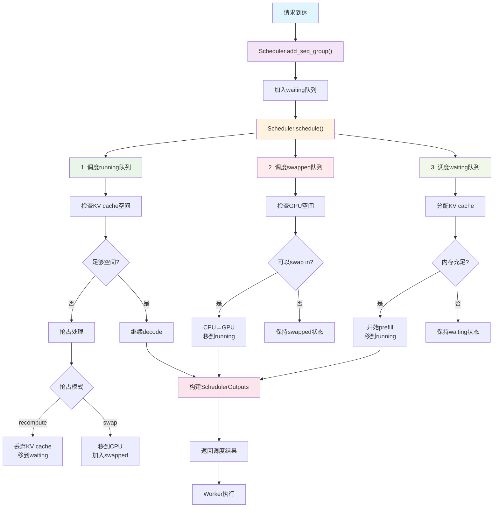
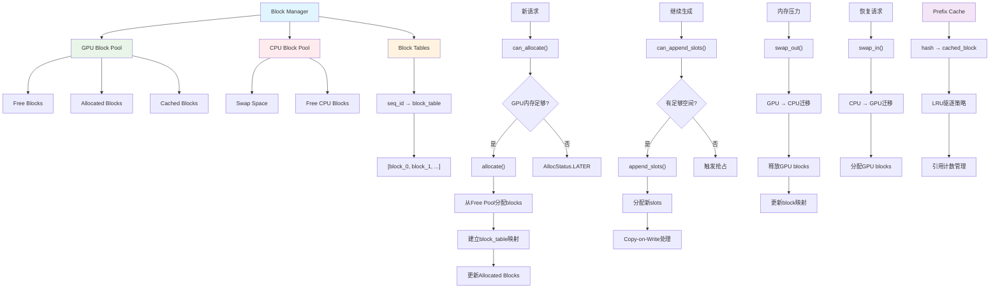

# Scheduler 详解

vLLM的Scheduler是整个系统的"大脑"，负责协调请求调度和KV cache管理。它不仅决定哪些请求在何时执行，还管理着整个系统的内存分配和回收。

## 1. Scheduler 架构概览

### 1.1 核心职责

**请求管理**：
- 维护三个队列：waiting(等待), running(运行), swapped(换出)
- 根据资源可用性调度请求
- 处理请求优先级和抢占策略

**KV Cache管理**：
- 通过Block Manager分配和释放GPU/CPU内存块
- 处理内存swap操作（GPU ↔ CPU）
- 实现prefix caching和block复用
- 管理内存碎片和垃圾回收

### 1.2 关键组件

```
Scheduler
├── Request Queues (请求队列)
│   ├── waiting: 新请求和被抢占的请求
│   ├── running: 正在处理的请求 
│   └── swapped: 被换出到CPU的请求
├── Block Manager (内存块管理器)
│   ├── GPU Block Pool: GPU内存块池
│   ├── CPU Block Pool: CPU内存块池
│   └── Block Tables: 每个序列的块表
└── Scheduling Budget (调度预算)
    ├── token_budget: 本次可处理的token数
    └── max_num_seqs: 最大序列数
```

## 2. 调度决策流程

### 2.1 schedule() 方法核心流程

```python
def schedule() -> Tuple[SequenceGroupMetadata, SchedulerOutputs, bool]:
    # 1. 调度运行中的请求 (decode阶段)
    running_scheduled = self._schedule_running(budget, curr_loras)
    
    # 2. 调度被换出的请求 (swap in)
    swapped_scheduled = self._schedule_swapped(budget, curr_loras)
    
    # 3. 调度等待中的请求 (prefill阶段)
    prefill_scheduled = self._schedule_prefills(budget, curr_loras)
    
    # 4. 构建最终的调度输出
    return build_scheduler_outputs(...)
```

### 2.2 调度策略

#### **Running队列调度**
- **优先级**：Running > Swapped > Waiting
- **资源检查**：验证是否有足够的KV cache空间继续生成
- **抢占策略**：资源不足时可能被换出或重新计算

#### **Swapped队列调度**  
- **换入条件**：GPU有足够空间且符合watermark要求
- **块复制**：CPU → GPU 的内存块迁移

#### **Waiting队列调度**
- **新请求处理**：分配初始KV cache空间
- **Chunked Prefill**：大prompt分块处理

## 3. KV Cache 管理机制

### 3.1 Block Manager 架构

```
Block Manager
├── Block Allocator (分配器)
│   ├── GPU Block Pool
│   ├── CPU Block Pool  
│   └── Block Evictor (驱逐器)
├── Block Tables (块表)
│   └── seq_id -> [block_0, block_1, ...]
└── Prefix Cache (前缀缓存)
    └── hash -> cached_block
```

### 3.2 内存分配流程

#### **新请求分配**：
1. **评估需求**：计算prompt需要的block数量
2. **检查可用性**：`can_allocate()` 检查GPU内存是否充足
3. **分配blocks**：从free pool中分配所需blocks
4. **建立映射**：创建逻辑block到物理block的映射

#### **继续生成**：
1. **检查空间**：`can_append_slots()` 验证是否可以继续
2. **追加slots**：为新token分配空间
3. **Copy-on-Write**：需要时复制block以支持beam search

### 3.3 Swap 机制

#### **Swap Out (GPU → CPU)**：
```python
def swap_out(seq_group):
    # 1. 检查CPU是否有足够空间
    if not can_swap_out(seq_group):
        raise MemoryError("CPU空间不足")
    
    # 2. 执行block迁移
    gpu_blocks = get_gpu_blocks(seq_group)
    cpu_blocks = allocate_cpu_blocks(len(gpu_blocks))
    copy_blocks(gpu_blocks, cpu_blocks)
    
    # 3. 更新映射表
    update_block_mapping(gpu_blocks, cpu_blocks)
    
    # 4. 释放GPU内存
    free_gpu_blocks(gpu_blocks)
```

#### **Swap In (CPU → GPU)**：
```python
def swap_in(seq_group):
    # 1. 检查GPU空间
    if not can_swap_in(seq_group):
        return AllocStatus.LATER
    
    # 2. 分配GPU blocks
    gpu_blocks = allocate_gpu_blocks(required_size)
    
    # 3. 从CPU复制数据
    cpu_blocks = get_cpu_blocks(seq_group)
    copy_blocks(cpu_blocks, gpu_blocks)
    
    # 4. 更新状态
    update_seq_status(seq_group, RUNNING)
```

## 4. 调度算法详解

### 4.1 资源预算计算

```python
class SchedulingBudget:
    token_budget: int        # 本批次最大token数
    max_num_seqs: int       # 最大序列数
    num_batched_tokens: int # 已调度token数
    num_curr_seqs: int      # 当前序列数
    
    def can_schedule(self, num_new_tokens, num_new_seqs):
        return (self.num_batched_tokens + num_new_tokens <= self.token_budget
                and self.num_curr_seqs + num_new_seqs <= self.max_num_seqs)
```

### 4.2 抢占策略

#### **抢占触发条件**：
- GPU内存不足
- 有更高优先级请求
- 达到资源限制

#### **抢占模式**：
1. **Recompute模式**：丢弃KV cache，重新计算
2. **Swap模式**：迁移到CPU内存

```python
def _preempt(self, seq_group, blocks_to_swap_out):
    if seq_group.has_multiple_seqs():
        # beam search等多序列情况使用swap
        return self._preempt_by_swap(seq_group, blocks_to_swap_out)
    else:
        # 单序列使用recompute，开销更小
        return self._preempt_by_recompute(seq_group)
```

### 4.3 Chunked Prefill

对于长prompt，vLLM使用分块处理策略：

```python
def _schedule_chunked_prefill():
    # 1. 限制并发长prefill数量
    max_long_prefills = scheduler_config.max_long_partial_prefills
    
    # 2. 为长prompt分配token预算
    chunk_size = min(prompt_length, available_budget)
    
    # 3. 允许短请求插队
    if prompt_length < long_prefill_threshold:
        schedule_immediately()
```

## 5. 性能优化机制

### 5.1 Prefix Caching

**缓存策略**：
- 相同prefix的请求共享KV cache blocks
- 使用hash值快速匹配
- LRU驱逐策略

**实现细节**：
```python
def allocate_with_prefix_cache(token_ids):
    # 1. 计算prefix hash
    prefix_hash = compute_hash(token_ids)
    
    # 2. 查找缓存
    cached_blocks = find_cached_prefix(prefix_hash)
    
    # 3. 复用缓存blocks + 分配新blocks
    return cached_blocks + allocate_new_blocks(remaining_tokens)
```

### 5.2 Block 复用机制

**Copy-on-Write**：
- 多个序列可共享只读blocks
- 写操作时自动复制block
- 减少内存占用

**Block合并**：
- 相同内容的blocks自动合并
- 引用计数管理生命周期

### 5.3 Watermark策略

```python
def check_watermark(required_blocks):
    free_blocks = get_num_free_gpu_blocks()
    watermark_blocks = total_blocks * watermark_ratio
    
    # 保留watermark避免频繁换出
    return free_blocks - required_blocks >= watermark_blocks
```

## 6. 调度输出结构

### 6.1 SchedulerOutputs

```python
@dataclass
class SchedulerOutputs:
    scheduled_seq_groups: List[ScheduledSequenceGroup]  # 本次调度的请求
    num_prefill_groups: int                             # prefill请求数
    num_batched_tokens: int                             # 总token数
    blocks_to_swap_in: List[Tuple[int, int]]           # 需要swap in的blocks
    blocks_to_swap_out: List[Tuple[int, int]]          # 需要swap out的blocks  
    blocks_to_copy: List[Tuple[int, int]]              # 需要复制的blocks
    ignored_seq_groups: List[SequenceGroup]            # 被忽略的请求
    num_lookahead_slots: int                           # 推测解码slots
    running_queue_size: int                            # 运行队列大小
    preempted: int                                     # 被抢占的请求数
```

### 6.2 执行指令

Scheduler的输出直接指导worker的操作：
- **scheduled_seq_groups**: 需要执行前向传播的请求
- **blocks_to_swap_***: 内存管理操作指令
- **blocks_to_copy**: Copy-on-Write操作指令

## 7. 错误处理和恢复

### 7.1 内存不足处理

```python
def handle_oom():
    # 1. 触发抢占
    preempted_groups = preempt_lowest_priority()
    
    # 2. 执行swap out
    swap_out_groups(preempted_groups)
    
    # 3. 清理碎片
    garbage_collect_blocks()
    
    # 4. 重新调度
    reschedule_remaining_requests()
```

### 7.2 调度失败恢复

- **资源等待**：AllocStatus.LATER，下次调度重试
- **永久失败**：AllocStatus.NEVER，拒绝请求
- **状态回滚**：调度失败时恢复原始状态

## 8. 监控和调试

### 8.1 关键指标

```python
# 内存使用率
gpu_cache_usage = 1.0 - (free_gpu_blocks / total_gpu_blocks)

# 缓存命中率  
prefix_cache_hit_rate = cached_tokens / total_tokens

# 队列长度
queue_lengths = {
    'waiting': len(scheduler.waiting),
    'running': len(scheduler.running), 
    'swapped': len(scheduler.swapped)
}

# 抢占统计
preemption_stats = {
    'recompute': recompute_count,
    'swap': swap_count
}
```

### 8.2 调试工具

- **Block可视化**：显示block分配状态
- **调度决策日志**：记录每次调度的决策过程
- **内存泄漏检测**：追踪未释放的blocks

## 9. 总结

vLLM的Scheduler通过精密的设计实现了：

✅ **高效的资源管理**：动态分配和回收GPU/CPU内存  
✅ **智能的调度策略**：平衡吞吐量和延迟  
✅ **先进的缓存机制**：prefix caching减少重复计算  
✅ **灵活的抢占机制**：应对资源竞争  
✅ **可扩展的架构**：支持分布式和异构部署  

这种设计使得vLLM能够在有限的GPU内存下服务更多请求，同时保持低延迟和高吞吐量。

## 10. 图解

### 10.1 Scheduler调度流程图



### 10.2 KV Cache管理架构图



### 10.3 调度时序图

```mermaid
sequenceDiagram
    participant Engine as LLMEngine
    participant Scheduler as Scheduler
    participant BlockMgr as BlockManager
    participant GPU as GPU Memory
    participant CPU as CPU Memory
    
    Note over Engine,CPU: 请求到达和调度
    Engine->>Scheduler: add_seq_group(request)
    Scheduler->>Scheduler: 加入waiting队列
    
    Note over Engine,CPU: 调度循环开始
    Engine->>Scheduler: schedule()
    
    Note over Scheduler,BlockMgr: 1. 处理Running队列
    Scheduler->>BlockMgr: can_append_slots(seq_group)
    BlockMgr->>GPU: 检查可用空间
    GPU-->>BlockMgr: 空间状态
    
    alt 空间充足
        BlockMgr-->>Scheduler: True
        Scheduler->>BlockMgr: append_slots()
        BlockMgr->>GPU: 分配新slots
        GPU-->>BlockMgr: 分配成功
    else 空间不足
        BlockMgr-->>Scheduler: False
        Scheduler->>Scheduler: 触发抢占
        
        alt Recompute模式
            Scheduler->>BlockMgr: free(seq)
            BlockMgr->>GPU: 释放blocks
            Scheduler->>Scheduler: 移到waiting队列
        else Swap模式
            Scheduler->>BlockMgr: swap_out(seq_group)
            BlockMgr->>CPU: 检查CPU空间
            CPU-->>BlockMgr: 空间可用
            BlockMgr->>GPU: 复制数据到CPU
            BlockMgr->>CPU: 保存blocks
            BlockMgr->>GPU: 释放GPU blocks
            Scheduler->>Scheduler: 移到swapped队列
        end
    end
    
    Note over Scheduler,BlockMgr: 2. 处理Swapped队列
    Scheduler->>BlockMgr: can_swap_in(seq_group)
    BlockMgr->>GPU: 检查watermark
    
    alt 可以swap in
        GPU-->>BlockMgr: 空间充足
        BlockMgr-->>Scheduler: AllocStatus.OK
        Scheduler->>BlockMgr: swap_in(seq_group)
        BlockMgr->>GPU: 分配GPU blocks
        BlockMgr->>CPU: 从CPU复制数据
        BlockMgr->>GPU: 恢复KV cache
        Scheduler->>Scheduler: 移到running队列
    else 空间不足
        GPU-->>BlockMgr: 空间不足
        BlockMgr-->>Scheduler: AllocStatus.LATER
        Scheduler->>Scheduler: 保持swapped状态
    end
    
    Note over Scheduler,BlockMgr: 3. 处理Waiting队列
    Scheduler->>BlockMgr: can_allocate(seq_group)
    BlockMgr->>GPU: 计算所需blocks
    BlockMgr->>GPU: 检查可用空间
    
    alt 空间充足
        GPU-->>BlockMgr: 空间充足
        BlockMgr-->>Scheduler: AllocStatus.OK
        Scheduler->>BlockMgr: allocate(seq_group)
        
        alt 启用Prefix Cache
            BlockMgr->>BlockMgr: 计算prefix hash
            BlockMgr->>BlockMgr: 查找cached blocks
            BlockMgr->>GPU: 复用缓存+分配新blocks
        else 普通分配
            BlockMgr->>GPU: 分配所需blocks
        end
        
        BlockMgr->>BlockMgr: 建立block_table映射
        Scheduler->>Scheduler: 移到running队列
    else 空间不足
        GPU-->>BlockMgr: 空间不足
        BlockMgr-->>Scheduler: AllocStatus.LATER
        Scheduler->>Scheduler: 保持waiting状态
    end
    
    Note over Scheduler,CPU: 构建调度输出
    Scheduler->>Scheduler: 构建SchedulerOutputs
    Scheduler-->>Engine: 返回调度结果
    
    Note over Engine,CPU: 内存管理指令
    Engine->>Engine: 处理blocks_to_swap_in
    Engine->>Engine: 处理blocks_to_swap_out
    Engine->>Engine: 处理blocks_to_copy
```



## 11. Scheduler与Engine的协作

从前面的`execute_model`分析和这里的scheduler分析，我们可以看到两者的紧密协作：

### 11.1 调用关系

```
LLMEngine.step()
├── scheduler.schedule()          # 🧠 调度决策
│   ├── 检查资源可用性
│   ├── 分配/回收KV cache
│   └── 返回SchedulerOutputs
├── model_executor.execute_model() # ⚡ 模型执行  
│   ├── 处理swap操作
│   ├── 执行模型前向传播
│   └── 返回SamplerOutput
└── 处理输出并更新状态        # 📤 结果处理
```

### 11.2 数据流转

1. **Scheduler输出 → Engine输入**：
   - `scheduled_seq_groups` → 模型要处理的请求
   - `blocks_to_swap_*` → GPU/CPU内存操作指令
   - `blocks_to_copy` → Copy-on-Write操作

2. **Engine输出 → Scheduler输入**：
   - 生成的新tokens → 更新序列状态
   - 完成的请求 → 释放KV cache
   - 错误状态 → 触发重调度

### 11.3 核心设计原则

**🎯 责任分离**：
- Scheduler负责"调度什么"
- Engine负责"如何执行"

**💾 资源管理**：
- Scheduler统一管理KV cache分配
- Engine按指令执行内存操作

**⚡ 性能优化**：
- Scheduler预测和预分配资源
- Engine批处理和异步执行

## 12. 总结

vLLM的Scheduler是一个高度优化的资源管理和调度系统：

🎯 **核心价值**：
- **智能调度**：动态平衡吞吐量和延迟
- **内存优化**：最大化GPU内存利用率  
- **缓存加速**：prefix caching减少重复计算
- **弹性扩展**：支持CPU swap和分布式部署

⚡ **设计亮点**：
- **分层队列**：waiting/running/swapped三级管理
- **抢占机制**：优雅处理资源竞争
- **块管理**：细粒度的内存分配和回收
- **预算控制**：精确的资源使用限制

🚀 **性能优势**：
- **高吞吐量**：批处理和连续batching
- **低延迟**：智能调度和内存管理
- **高利用率**：动态资源分配和共享
- **强扩展性**：支持大规模并发服务

通过深入理解Scheduler的工作机制，我们可以更好地配置和优化vLLM系统，实现高效的大语言模型推理服务。 